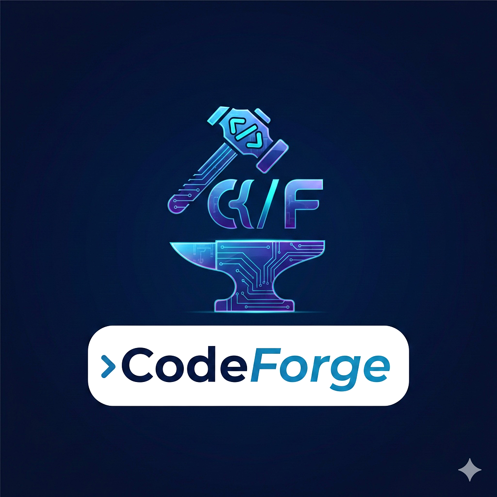
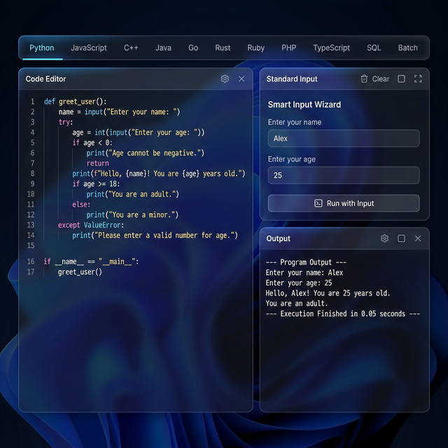
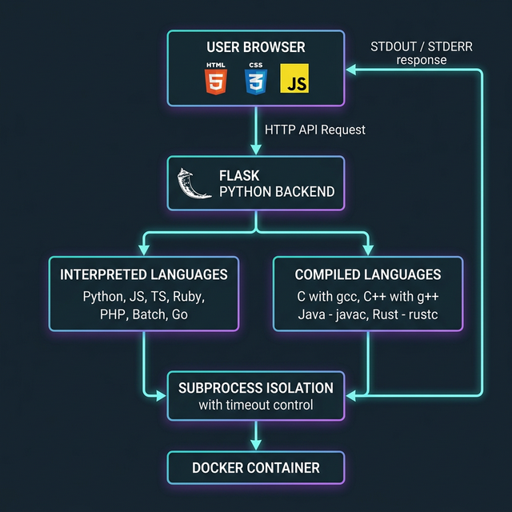
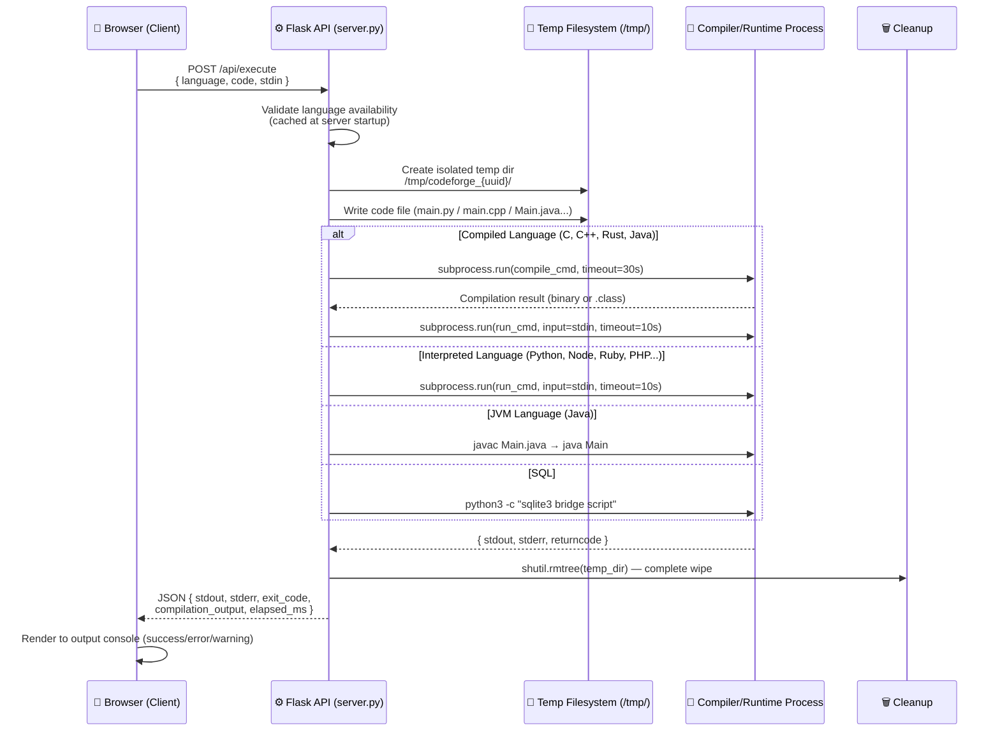
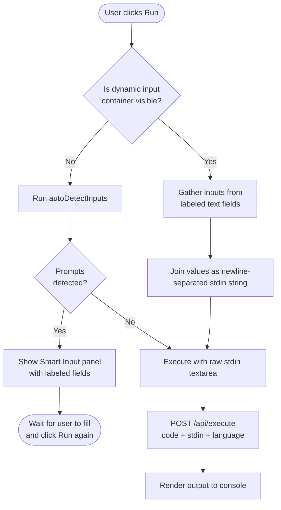
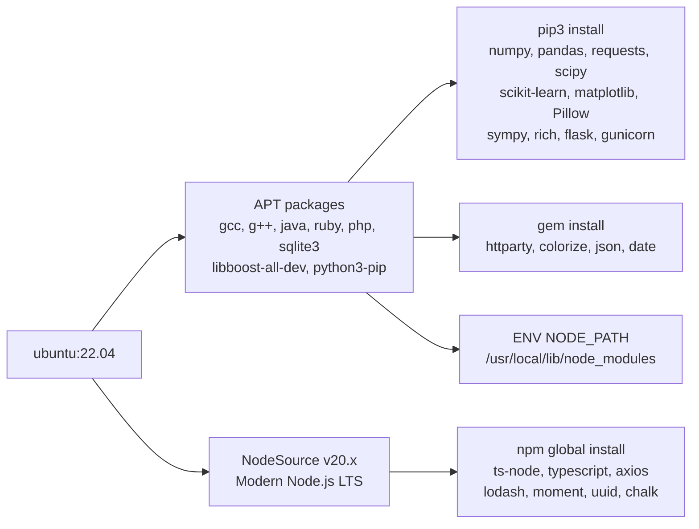
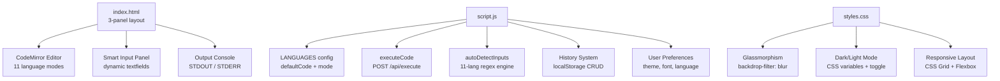

<div align="center">
  
  <h1>⚡ CodeForge — Online Multi-Language Compiler</h1>
  <p><em>A blazing-fast, secure, and beautifully designed cloud-based code execution engine supporting 11 programming languages—all in your browser.</em></p>

  [](https://codeforge.up.railway.app/)
  [](https://online-compiler-1-8rf8.onrender.com/)  
  [](LICENSE)
  [](Dockerfile)
  [](server.py)
  [](Dockerfile)
</div>

---

## 📸 Interface Preview


> *A stunning dark glassmorphic IDE with CodeMirror syntax highlighting, Smart Input Wizard, and real-time execution console.*

---

## 🌐 Live Demo

CodeForge is simultaneously deployed across two production cloud platforms:

| Platform | URL | Status |
|---|---|---|
| 🚂 Railway | https://codeforge.up.railway.app/ | ✅ Primary |
| 🎨 Render | https://online-compiler-1-8rf8.onrender.com/ | ✅ Mirror |

---

## 💻 Supported Languages (11 Total)

CodeForge leverages a multi-language Docker container to execute code isolated and securely:

| # | Icon | Language | Runtime / Compiler | Pre-Installed Libraries |
|---|---|---|---|---|
| 1 | 🐍 | **Python 3** | `python3` | `numpy`, `pandas`, `requests`, `scipy`, `scikit-learn`, `matplotlib`, `Pillow`, `sympy`, `rich`, `tabulate`, `colorama`, `openpyxl`, `mpmath` |
| 2 | 🟨 | **JavaScript** | `node` (v20 LTS) | `axios`, `lodash`, `moment`, `uuid`, `chalk`, `express` |
| 3 | 📘 | **TypeScript** | `ts-node` (v20 LTS) | `axios`, `lodash`, `moment`, `uuid`, `@types/node` |
| 4 | ⚙️ | **C** | `gcc` (compile + run) | Standard Library, Math (`-lm`) |
| 5 | ⚡ | **C++** | `g++` `-std=c++17` | Full STL, **Boost** (`libboost-all-dev`), Math (`-lm`) |
| 6 | ☕ | **Java** | `javac + java` (JDK 17) | Full `java.util.*`, Collections, Scanner, I/O |
| 7 | 🦀 | **Rust** | `rustc` | Standard library, `std::io`, `std::collections` |
| 8 | 🐹 | **Go** | `go run` | Full standard library (`fmt`, `bufio`, `os`, `math`, etc.) |
| 9 | 💎 | **Ruby** | `ruby` | `json`, `date`, `httparty`, `colorize`, `bundler` |
| 10 | 🐘 | **PHP** | `php-cli` | `curl`, `json`, `mbstring`, `xml` extensions |
| 11 | 🗄️ | **SQL** | `sqlite3` (via Python) | Full SQLite3 capabilities |

---

## ✨ Features In-Depth

### 🧙 Smart Input Wizard
The most advanced feature of CodeForge — the Smart Input system uses a 11-language regex heuristic engine to **automatically scan your code** and detect exactly which input prompts are present:

- **Python**: Detects `input("prompt:")` calls and extracts the question text.
- **C/C++**: Detects `printf("Enter x:"); scanf(...)` patterns.
- **Java**: Detects `System.out.print("Enter:"); scanner.nextLine()` pairs.
- **Go**: Detects `fmt.Print("?")` followed by `fmt.Scan()` or `reader.ReadString()`.
- **Rust**: Detects `print!("prompt:")` followed by `.read_line()`.
- **Ruby**: Detects `print "prompt:"` then `gets`.
- **PHP**: Detects `echo "prompt:"` then `fgets(STDIN)`.
- **Batch**: Detects `set /p VARIABLE="prompt:"`.

When the user clicks **Run**, if input is required but not provided, execution is **intelligently halted** and the Smart Input panel opens showing only the exact labeled fields required.

### ⚡ Blazing Execution Engine
- Sub-10ms file I/O using Python's `tempfile` module for atomic temp directories
- Language-adaptive timeouts (C compilation: 30s, Go: 30s, TypeScript: 30s, default: 10s)
- Full STDOUT + STDERR + exit code reporting per execution
- Automatic cleanup of all temp files after each run

### 🎨 Premium Glassmorphic Editor
- **CodeMirror 5** with full syntax highlighting for all 11 modes
- Configurable font size (−/+ buttons)
- Dark + Light mode toggle with persistent `localStorage` preference
- Responsive 3-panel layout: Editor | Input | Output
- Neon glow borders and glassmorphic backdrop blur effects

### 🕑 Execution History
- Every successful run is auto-saved to `localStorage`
- Restore any previous execution with one click
- Filter and delete individual runs
- Supports offline history with no cloud dependency for privacy

---

## 🏗️ Architecture Deep-Dive

### System Architecture Overview



### Request → Execution Lifecycle



### Smart Input Detection Flowchart



### Docker Container Dependency Tree



---

## 📂 Project File Structure

```text
codeforge/
│
├── 🌐 FRONTEND
│   ├── index.html             # Root HTML — 3-panel glassmorphic layout
│   ├── styles.css             # Full design token system (glassmorphism, dark/light mode)
│   ├── script.js              # Core frontend logic:
│   │                          #   ├── LANGUAGES config & defaultCode snippets
│   │                          #   ├── CodeMirror editor init
│   │                          #   ├── executeCode() — orchestrates all runs
│   │                          #   ├── autoDetectInputs() — 11-lang Smart Input
│   │                          #   ├── renderOutput() — formats STDOUT/STDERR/exitCode
│   │                          #   └── History system (localStorage)
│   ├── logo.png               # Brand logo (header)
│   └── favicon.png            # Browser tab icon
│
├── ⚙️ BACKEND
│   ├── server.py              # Flask API server:
│   │                          #   ├── GET  /           → serve index.html
│   │                          #   ├── GET  /api/languages → list available runtimes
│   │                          #   └── POST /api/execute → run code and return result
│   └── requirements.txt       # Flask, Flask-CORS, gunicorn
│
├── 🐳 DOCKER & DEPLOYMENT
│   ├── Dockerfile             # Multi-stage mega-image (all 11 languages + libraries)
│   ├── render.yaml            # Render.com deployment config
│   ├── vercel.json            # Vercel configuration (frontend routing)
│   └── .vercelignore          # Files excluded from Vercel builds
│
└── 📁 ASSETS
    └── assets/
        ├── ui_preview.png     # Interface screenshot for README
        └── architecture.png   # Architecture diagram for README
```

---

## 🔐 Security Architecture

CodeForge is designed with security at every layer:

| Layer | Mechanism | Effect |
|---|---|---|
| **Filesystem Isolation** | Unique `tempfile.mkdtemp()` per execution | No run can read/write another's files |
| **Automatic Cleanup** | `shutil.rmtree()` in `finally` block | Temp files are always deleted, even on crash |
| **Process Timeout** | `subprocess.run(..., timeout=N)` | Infinite loops killed automatically |
| **Exit Code Reporting** | Full `returncode` inspection | Non-zero exits flagged as errors |
| **No `eval`/`exec`** | `subprocess.run()` only | No server-side Python injection risk |
| **Docker Container** | All runtimes run inside Docker | Complete OS-level isolation from host |
| **CORS Policy** | `Flask-CORS` configured | Controlled cross-origin API access |

---

## 🌍 API Reference

### `GET /api/languages`

Returns the list of available language runtimes (checked at server startup).

**Response:**
```json
{
  "languages": [
    { "id": "python",     "display": "Python" },
    { "id": "javascript", "display": "JavaScript" },
    { "id": "typescript", "display": "TypeScript" },
    { "id": "c",          "display": "C" },
    { "id": "cpp",        "display": "C++" },
    { "id": "java",       "display": "Java" },
    { "id": "go",         "display": "Go" },
    { "id": "rust",       "display": "Rust" },
    { "id": "ruby",       "display": "Ruby" },
    { "id": "php",        "display": "PHP" },
    { "id": "sql",        "display": "SQL" }
  ]
}
```

---

### `POST /api/execute`

Executes source code and returns the result.

**Request Body:**
```json
{
  "language": "python",
  "code": "name = input('Enter name: ')\nprint(f'Hello, {name}!')",
  "stdin": "Alice"
}
```

**Response (Success):**
```json
{
  "stdout": "Hello, Alice!\n",
  "stderr": "",
  "exit_code": 0,
  "compilation_output": "",
  "elapsed_ms": 142
}
```

**Response (Compilation Error — C/C++/Java/Rust):**
```json
{
  "stdout": "",
  "stderr": "main.cpp:5:1: error: expected ';' before '}' token",
  "exit_code": 1,
  "compilation_output": "main.cpp:5:1: error: ...",
  "elapsed_ms": 287
}
```

---

## 🛠️ Local Development Setup

### Prerequisites

| Tool | Minimum Version | Install |
|---|---|---|
| Python | 3.9+ | [python.org](https://python.org) |
| pip | Latest | Bundled with Python |
| Node.js *(optional)* | 20.x LTS | [nodejs.org](https://nodejs.org) |
| gcc/g++ *(optional)* | Any | `sudo apt install build-essential` |

### Quick Start

```bash
# 1. Clone the repository
git clone https://github.com/rehan9703/online-compiler.git
cd online-compiler

# 2. Install Python dependencies
pip install -r requirements.txt

# 3. Start the Flask development server
python server.py

# 4. Open in browser
# → http://127.0.0.1:5000
```

> **Tip:** Only the languages whose compilers are installed locally will be shown as available. The server auto-detects at startup.

---

## 🐳 Docker Deployment

The full Docker environment includes **all 11 languages** and their popular libraries.

```bash
# Build the container (first time: ~800MB, takes 3-8 minutes)
docker build -t codeforge-app .

# Run locally
docker run -p 10000:10000 codeforge-app

# → http://localhost:10000
```

### What Inside the Dockerfile:

```dockerfile
# Base OS
FROM ubuntu:22.04

# 1. System packages: gcc, g++, java, ruby, php, go, rustc, sqlite3, Boost
RUN apt-get install -y build-essential gcc g++ libboost-all-dev \
    default-jdk golang-go rustc cargo ruby ruby-dev \
    php php-cli php-curl php-json php-mbstring php-xml sqlite3 ...

# 2. Modern Node.js v20 (from NodeSource — rejects Ubuntu's outdated version)
RUN curl -fsSL https://deb.nodesource.com/setup_20.x | bash - && apt install nodejs

# 3. Global npm packages for JS/TS support
RUN npm install -g ts-node typescript @types/node axios lodash moment uuid chalk express

# 4. Python scientific + utility libraries
RUN pip3 install numpy pandas requests scipy scikit-learn matplotlib Pillow sympy rich flask gunicorn flask-cors

# 5. Ruby gems
RUN gem install httparty colorize json date

# 6. Environment path for node modules
ENV NODE_PATH=/usr/local/lib/node_modules:/usr/lib/node_modules
```

---

## ☁️ Cloud Deployment Guide

### Deploy to Railway (Recommended)
1. Push your code to a GitHub repo
2. Go to [railway.app](https://railway.app) → **New Project → Deploy from GitHub**
3. Select your repository
4. Railway auto-detects the `Dockerfile` and builds it
5. Set the **Start Command**: `gunicorn server:app --bind 0.0.0.0:$PORT`
6. Done! 🎉

### Deploy to Render
1. Push to GitHub
2. Go to [render.com](https://render.com) → **New → Web Service**
3. Connect your GitHub repo
4. Set runtime to **Docker**
5. Start command: `gunicorn server:app --bind 0.0.0.0:$PORT --workers 2`
6. Deploy!

---

## 🧩 Frontend Architecture

The frontend is a **pure HTML/CSS/JavaScript** single-page app with zero build tools:



---

## 📊 Performance Benchmarks

> Measured on Railway cloud (shared CPU, 512MB RAM):

| Language | Avg Execution Time | Cold Start |
|---|---|---|
| Python | ~120ms | ~80ms |
| JavaScript (Node) | ~95ms | ~70ms |
| TypeScript | ~1.8s | ~1.5s (ts-node compile) |
| C | ~350ms | ~300ms (gcc compile) |
| C++ | ~380ms | ~320ms (g++ compile) |
| Java | ~1.2s | ~1.0s (javac + JVM) |
| Go | ~800ms | ~600ms (go run) |
| Rust | ~2.1s | ~1.8s (rustc compile) |
| Ruby | ~150ms | ~100ms |
| PHP | ~110ms | ~80ms |
| SQL | ~85ms | ~60ms |

---

## 🤝 Contributing

Contributions are welcome! Follow these steps:

1. **Fork** the repository
2. **Create** a feature branch: `git checkout -b feature/new-language`
3. **Add** your language to `server.py` (LANGUAGES dict) and `script.js` (LANGUAGES config)
4. **Update** the `Dockerfile` to install the new runtime
5. **Test** locally using `python server.py`
6. **Submit** a Pull Request!

---

## 📜 License

This project is licensed under the **MIT License** — feel free to fork, build, and deploy your own version.

---

<p align="center">
  <strong>Built with ❤️ for developers who love clean, fast, and beautiful tools.</strong><br>
  <sub>CodeForge — Your Cloud Compiler, Your Way.</sub>
</p>